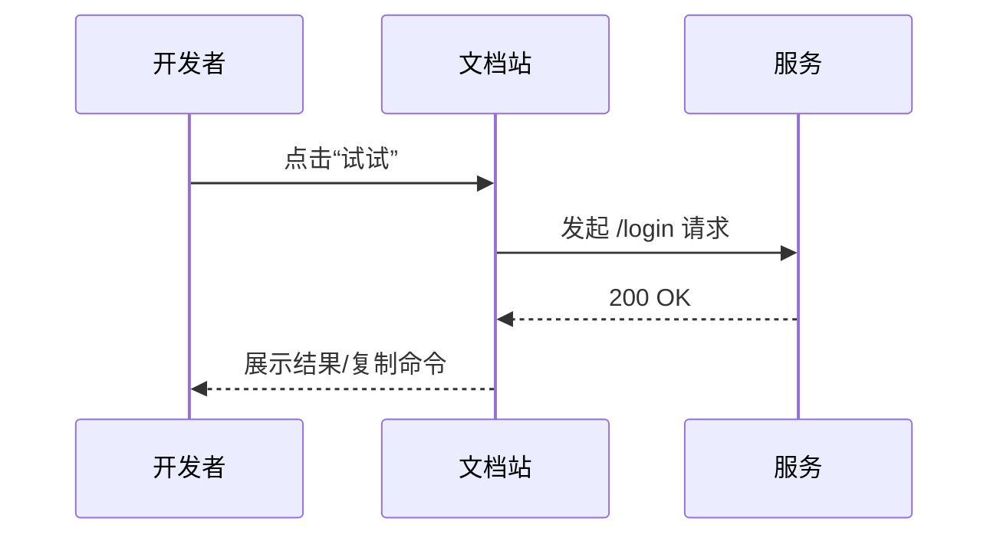
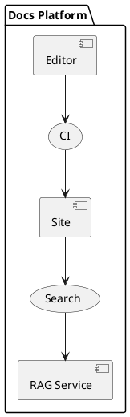

# 36. 文档即代码 & 知识管理 📚🧠🛠️

> 把“知道”变成“可复用资产”。这一章给你一整套 **Docs-as-Code + 知识库治理** 作战手册：目录信息架构、内容流水线、可执行文档、版本化与多语言、搜索与 RAG、权限合规、健康度度量，以及能直接抄的 CI 配置与模版。上船即开冲。🚀

---

## 0）心法（四句箴言）🧘

1) **写下来 > 说一遍**：文字是团队的“可寻址记忆”。  
2) **代码的严谨给到文档**：评审、测试、版本、回滚一个不少。  
3) **内容即 API**：有契约、有变更日志、有可执行样例。  
4) **默认公开，必要加密**：越多内容可被搜索到，团队越聪明；但要守边界。

---

## 1）信息架构（IA）：让知识“找得到、认得出”🗂️

- **三层骨架**：领域（Domain） → 能力（Capability） → 任务（How-to）。  
- **四类文档**：`/concepts` 概念、`/how-to` 操作、`/reference` 参考、`/cookbook` 配方。  
- **命名规范**：动词短语 + 主题（如 `deploy-to-vercel.md`）。  
- **Frontmatter 元数据**（用来驱动搜索/版本/租户）：
  ```yaml
  ---
  title: 部署到 Vercel
  slug: /deploy/vercel
  tags: [deploy, vercel, frontend]
  product: web
  version: 2.1
  owner: web-platform
  lastReviewed: 2025-09-10
  ---
  ```

---

## 2）Docs-as-Code 流水线（仓库→构建→发布）⚙️

**目录建议**
```
docs/
  concepts/       # 概念
  how-to/
  reference/      # API / CLI / 配置
  cookbook/
  assets/         # 图片/图表/附件
  _snippets/      # 与代码库同步的示例片段（只读）
  .vale/          # 文风检查
  .textlint/      # 语言/拼写/术语
```

**工具选型**
- 站点：**Docusaurus / Nextra(Next.js) / MkDocs(Material)** 任一  
- 文风/拼写：**Vale**、**textlint/cspell**、**markdownlint**、**alex**  
- 链接体检：**lychee / markdown-link-check**  
- 图表即代码：**Mermaid / PlantUML / Graphviz**  
- 变更日志：**Changesets** 或 `docs/CHANGELOG.md`  
- 搜索：内置（Lunr/Meili/Algolia）+ 嵌入式同义词/别名表

**GitHub Actions（构建+校验+发布）**
```yaml
name: docs-ci
on:
  push: { branches: [main] }
  pull_request:
jobs:
  lint-build:
    runs-on: ubuntu-latest
    steps:
      - uses: actions/checkout@v4
      - uses: actions/setup-node@v4
        with: { node-version: 20 }
      - run: npm ci
      - name: Lint (markdown/style/spell)
        run: |
          npx markdownlint-cli2 **/*.md
          npx cspell "**/*.{md,mdx}" --no-progress
          npx vale sync && npx vale --minAlertLevel=warning docs/
      - name: Link check
        run: npx lychee --no-progress --max-concurrency 8 --accept '200,206,429' "docs/**/*.md"
      - name: Build site
        run: npm run build:docs
      - name: Upload artifact
        uses: actions/upload-pages-artifact@v3
        with: { path: build }
  deploy:
    needs: lint-build
    permissions: { pages: write, id-token: write }
    runs-on: ubuntu-latest
    environment: { name: github-pages, url: ${{ steps.deployment.outputs.page_url }} }
    steps:
      - id: deployment
        uses: actions/deploy-pages@v4
```

**Vale（文风规则片段）**
```ini
# .vale.ini
StylesPath = .vale
MinAlertLevel = warning
[*.{md,mdx}]
BasedOnStyles = Vale, Google
TokenIgnores = (\{#.*\})  # 忽略锚点
```

---

## 3）代码片段“单一事实源”：示例与文档自动同步 🔗

> 文档中的代码 **不得** 手工复制粘贴。来自“真代码”的标注片段，CI 校验漂移。

**在源码里打标**
```ts
// file: packages/sdk/src/client.ts
// [docs-snippet:start:login]
export async function login(email: string, pwd: string) {
  const res = await fetch('/api/login',{ method:'POST', body: JSON.stringify({ email, pwd })});
  if (!res.ok) throw new Error('auth failed');
  return res.json();
}
// [docs-snippet:end:login]
```

**在文档中引用**
```md
使用 SDK 登录（TypeScript）：
```ts file=_snippets/sdk-login.ts
// 将在 CI 中由 scripts/extract-snippets.ts 自动生成
```
```

**提取脚本（简化版）**
```ts
// scripts/extract-snippets.ts
import { globby } from 'globby'; import fs from 'node:fs';
const files = await globby(['packages/**/*.ts']);
for (const f of files) {
  const s = await fs.promises.readFile(f,'utf-8');
  const re = /\/\/ \[docs-snippet:start:(.+?)\]([\s\S]*?)\/\/ \[docs-snippet:end:\1\]/g;
  for (const m of s.matchAll(re)) {
    const id = m[1]; const body = m[2].trimStart();
    await fs.promises.writeFile(`docs/_snippets/${id}.ts`, body);
  }
}
```

**CI 校验不一致**
```bash
# 在 CI 里跑
node scripts/extract-snippets.ts
git diff --exit-code || (echo "❌ 文档片段与源码不一致"; exit 1)
```

---

## 4）可执行文档：图、例、测，一条龙 🧪

**Mermaid 序列图**


**OpenAPI → Reference 自动生成**
```bash
# 生成 API 文档（Docusaurus + Redocusaurus / Stoplight 皆可）
npx redocly build-docs openapi.yaml -o docs/reference/api.html
```

**在 Markdown 中跑示例测试（doctest 风格）**
```md
我们希望 `sum` 在边界条件能工作：
```ts doctest
import { sum } from '../../packages/utils/sum';
assert.equal(sum(0, 0), 0)
assert.equal(sum(-1, 1), 0)
```
```
> CI 内用脚本提取 ` ```ts doctest` 代码块交给 Vitest/Jest 运行，失败则 PR 挡回。

---

## 5）版本化与 i18n（多语言不翻车）🌍

- **版本**：`latest`（开发中） + `stable`（发布线）；打 tag 时切文档分支或内容 snapshot。  
- **变更可见**：每页渲染“上次审阅时间（Last Reviewed）”，超过 N 天**高亮提醒**。  
- **翻译**：`/i18n/<locale>` 目录；**源文档变更 PR 必须带 `needs-translation` 标签**；允许“回退到英文”回退块。  
- **术语表**：`docs/glossary.md` + 术语校验（textlint 术语词典）。

---

## 6）搜索与知识发现：从关键词到语义（RAG）🔎

**关键词搜索（内置）**  
- Lunr/Meili/Algolia：构建索引时把 `title/h1/h2/tags/frontmatter` 作为权重字段。  
- **同义词词典**：`dev, engineer, 工程师` 映射；拼写纠错建议。

**语义检索（RAG，一段最简思路）**
```ts
// scripts/embed.ts（伪）——将 Markdown 切块嵌入到向量库
import fs from 'node:fs/promises';
import { chunkMd } from './chunk'; // 标题感知切块
import { embed } from './embedder'; // 你选用的嵌入模型
for (const file of await list('docs/**/*.md')) {
  const md = await fs.readFile(file, 'utf8');
  for (const c of chunkMd(md, { by: 'heading', max: 800 })) {
    const vec = await embed(c.text);
    await upsert('kb', { id: hash(file+c.idx), vector: vec, meta: { file, heading: c.heading, tags: c.tags }});
  }
}
```
- **前端问答**：用户问题 → 检索 top-k → 压缩（Map-Reduce 摘要）→ 展示来源链接。  
- **权限**：**embedding 查询也要过滤 ACL**（目录/租户/标签），避免“越权泄漏”。  
- **时效**：每次合并后增量更新索引；失败不影响站点发布。

---

## 7）安全与合规：不把“秘密”写公网 🧷

- **密钥/凭据扫描**：`gitleaks / trufflehog` 入 CI；发现即失败。  
- **内容分级**：`public/internal/confidential/restricted` 标签，构建时按环境裁剪。  
- **DLP**：PII/敏感词检测；导出/删除请求遵守隐私法规。  
- **水印/审计**：内部 PDF 导出自动加水印；访问日志保留 180 天，可回溯。

---

## 8）文档健康度与 SLO（让文档也“可运维”）📈

- **Freshness（新鲜度）**：`fresh = lastReviewed < 90d`。  
- **覆盖率**：API/CLI/组件 → “有文档”占比与“有示例”占比。  
- **可用性**：构建成功率、链接通过率、搜索 0 结果率。  
- **参与度**：PV、阅读停留、跳出、反馈赞踩。  
- **SLO**：`broken links = 0`；`freshness ≥ 85%`；`PR 文档配比 ≥ 0.8`（每 5 个代码 PR 至少 4 个对应文档变更）。

**健康度面板（字段建议）**
```
docs_fresh_ratio, docs_build_success, docs_link_errors,
doc_coverage_api, doc_example_coverage, search_zero_ratio
```

---

## 9）常用技术栈对比 🧩

| 方案 | 亮点 | 注意 |
|---|---|---|
| **Docusaurus** | React/MDX、版本化/i18n 开箱、生态全 | 首屏略大，建议预渲染与缓存 |
| **Nextra(Next.js)** | 组件化极强、可玩性高、可直连数据 | 需要自己拼搜索/版本 |
| **MkDocs(Material)** | 轻量、好看、配置直白 | React 交互弱、MDX 能力弱 |
| **Docsify** | 零构建本地开箱 | 大型站点与 SEO 一般 |

---

## 10）Runbook（运行手册）与知识治理 🧑‍⚕️

**Runbook 模板**
```md
# Runbook: {系统名}
SLO: 可用性 99.9%，P95<200ms
监控看板：{link}
告警通道：{slack-chan}
常见故障 → 处置脚本：...
回滚剧本：...
当值排班：@oncall
```

**知识治理节律**
- **每月知识清扫**：过期页面归档；孤儿页挂钩导航。  
- **内容审阅轮值**：Owner 轮班；值班期内负责标签、Broken link、反馈处理。  
- **知识债看板**：像技术债一样列出来，按影响排序偿还。

---

## 11）模版库（复制即用）📎

**ADR（Architecture Decision Record）**
```md
# ADR-{编号}: {决策标题}
Status: Proposed/Accepted/Deprecated
Context: 背景与约束
Decision: 决策与边界
Consequences: 正负面影响
Alternatives: 备选方案与放弃理由
Owner/Date:
```

**RFC（技术设计）**
```md
# RFC: {主题}
Problem: 要解决的具体问题（含指标）
Proposal: 总体方案/组件图/序列图
Impact: 性能/安全/成本/团队
Rollout: 里程碑/灰度/回滚
Open Questions:
```

**Postmortem（无责复盘）**
```md
事件：{标题} 等级：SEV-?
时间线：...
影响：用户/时长/金额
根因：系统/流程/人
缓解：立即/短期/长期
行动项：Owner + DDL
```

---

## 12）实战片段：Mermaid、PlantUML、MDX 组件 🌈

**PlantUML（组件关系）**


**MDX Demo 按钮（Docusaurus/Nextra 都可改造）**
```jsx
export function TryIt({curl}) {
  async function run() {
    const res = await fetch('/api/try', { method:'POST', body: JSON.stringify({ curl })});
    alert(await res.text());
  }
  return <button onClick={run}>一键试试 🚀</button>;
}
```

---

## 13）Checklist（上线前最后一眼）✅

- [ ] 站点栈选型就绪（Docusaurus/Nextra/MkDocs）  
- [ ] CI：文风/拼写/链接/构建/预览/发布全绿  
- [ ] 代码片段与文档**自动同步**（提取+校验）  
- [ ] 可执行文档：Mermaid/示例 doctest/OpenAPI 导入  
- [ ] 版本化与 i18n：`latest`/`stable`；翻译回退策略  
- [ ] 搜索：关键词 + 语义（RAG）并做 ACL 过滤  
- [ ] 安全：密钥扫描、内容分级、DLP  
- [ ] 健康度：Freshness、Coverage、Broken links = 0  
- [ ] 治理节律：月度清扫 + Owner 轮值 + 知识债看板

---

### 小结

**文档即代码**不是把 MD 放仓库就完事，而是用**工程化的铁三角**——版本/测试/发布——来运营你的知识；  
**知识管理**不是建个 Wiki 就算，而是让知识**被发现、被复用、被度量**。  
当**内容有契约**、**示例可执行**、**搜索懂语义**、**健康可观测**，你的团队就拥有了一个会自己进化的“第二大脑”。💡🧠✨
